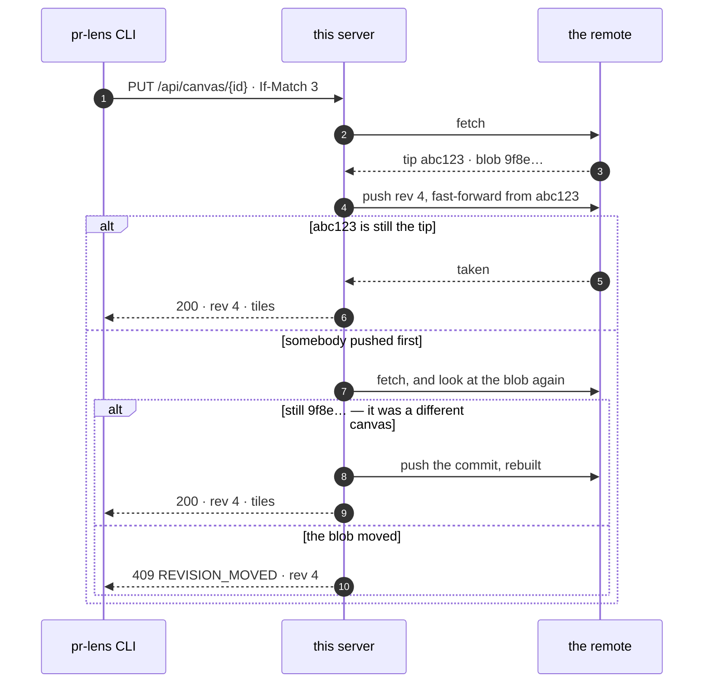

<div align="center">

# 🗺️ pr-lens-git-backend

**A private [PR Lens](https://github.com/coldteadotai/pr-lens) canvas server — with a git repository as the whole database.**

[](https://github.com/thejoeejoee/pr-lens-git-backend/actions/workflows/ci.yml)
[](https://www.npmjs.com/package/pr-lens-git-backend)
[](https://github.com/thejoeejoee/pr-lens-git-backend/pkgs/container/pr-lens-git-backend)
[](docs/how-to/deploy-with-helm.md)
[](https://github.com/coldteadotai/pr-lens/blob/main/docs/canvas-api.md)
[](LICENSE)

</div>

It speaks version 1 of the
[canvas API](https://github.com/coldteadotai/pr-lens/blob/main/docs/canvas-api.md)
in full, so `pr-lens canvas push`, `pull`, `rotate` and `delete` work against it
exactly as against prlens.dev — and a document pushed here never touches
prlens.dev.

```bash
export PR_LENS_API_URL=https://lens.example.com
pr-lens canvas push
```

It draws, too. The renderer is MIT, so pushes come back with the same tiles the
hosted app would answer with — this is a real one, straight out of `renderAll`:

<div align="center">
<picture>
  <source srcset="docs/assets/example-dark.svg" media="(prefers-color-scheme: dark)">
  
</picture>
</div>

## 🧩 Why a git repository is enough

The contract needs one thing that is easy to get wrong: `If-Match` has to be a
**real compare-and-swap**, or two pushes on the same revision silently overwrite
each other.

Git hands that over twice. A blob's object id *is* a hash of its contents, so a
read can hand back "the version I gave you" for free and a write can insist the
path still holds it. And a push is a fast-forward or it is refused, so no write
can land on a tip its author never saw:



No database, no lock, no lease, and no host-specific API — gitlab.com, a
self-managed GitLab, GitHub, Gitea, Forgejo, a bare repository over ssh. Nothing
is ever checked out: the server keeps a bare mirror and writes through plumbing,
and that mirror is a cache it can lose without losing a canvas.

And a bonus the contract explicitly does not offer: every push is a commit, so
`git log` over a canvas file **is** the revision history.

This began as a GitLab-API server, and the repository it wrote is the one this
reads — same paths, same bytes, same commit messages, so moving is renaming a few
environment variables. [The long version](docs/explanation/why-git.md) has the
reasoning and the costs; [the migration table](docs/reference/configuration.md#coming-from-the-gitlab-api-store)
has the renames.

## 🚀 Start here

```bash
STORE=memory npx pr-lens-git-backend   # forgets everything on restart
```

Then [the tutorial](docs/tutorial.md) — a canvas of your own, in a repository of
your own, in about ten minutes.

## 📚 Documentation

| | |
| --- | --- |
| 🎓 **[Tutorial](docs/tutorial.md)** | Your first canvas, from nothing. |
| 🔧 **How-to** | [Connect a remote](docs/how-to/connect-a-remote.md) · [Deploy with Helm](docs/how-to/deploy-with-helm.md) · [Put a CDN in front](docs/how-to/put-a-cdn-in-front.md) · [Cut a release](docs/how-to/releasing.md) |
| 📖 **Reference** | [Configuration](docs/reference/configuration.md) · [Routes](docs/reference/routes.md) · [Storage layout](docs/reference/storage.md) |
| 💡 **Explanation** | [Why git works](docs/explanation/why-git.md) · [Determinism and caching](docs/explanation/determinism-and-caching.md) |

## ⚡ The CDN half

Pictures are never stored. The renderer reads no clock, no file and no random
number, so the same document always produces the same bytes — which means any
replica can redraw any picture it holds the document for, and a picture's hash
can be its name:

| Route | `Cache-Control` | |
| --- | --- | --- |
| `/images/{id}/…-{hash}.svg` | `immutable`, one year | ♾️ the hash is in the name, so these bytes can never change |
| `/c/{id}.svg` | 60 s + ETag | 🔄 the embed address stays put, so it revalidates on the render's hash |
| `/c/{id}` · `/api/canvas/…` | `no-store` | 🔒 the contract's own rule: no cache may keep a document under a secret address |

Put a CDN in front and the only traffic reaching this server is the API. No CDN
to reach for? `cache.enabled=true` puts [Vinyl Cache](https://vinyl-cache.org) in
the pod as a sidecar and points the Service at it — and it needs no path rules,
because the headers above are already the whole policy.
[How, and the one thing to get right](docs/how-to/put-a-cdn-in-front.md).

## 🔐 Security in one list

- 🎲 Ids and tokens are 128 random bits, base64url, as the contract specifies.
  The id is the read capability, the token the write capability.
- 🧂 Only a hash of the token is stored, compared in constant time. A copy of the
  repository is not a copy of every token — there is a test for exactly that.
- 🕳️ `NOT_FOUND` covers an unminted id, a wrong token and an unpushed canvas with
  one answer, so a guesser learns nothing.
- 📓 Ids stay out of the logs. An access log should not be a list of live canvases.
- 🔗 The write token rides in a URL fragment and nowhere else, so no browser
  sends it to a server or a referrer.
- 🤐 An internal fault leaves as a bare 500 with no envelope, which the CLI reads
  as "unavailable" — the truth, rather than a made-up code it would act on.

## 🛠️ Development

```bash
npm ci
npm test          # 61: the contract over HTTP, the store against a real repository
npm run typecheck
npm run dev       # reloads on change
npm run build     # dist/, which is what gets published
```

TypeScript run directly by Node — no bundler, no loader, no build step to develop
against. Node 22.18 or newer strips the types itself; the published package and
the container image run the compiled `dist/`.

Releasing is merging a pull request. [release-please](https://github.com/googleapis/release-please)
keeps one open, reading the conventional-commit subjects to pick the next version
and write [the changelog](CHANGELOG.md); merging it tags, and the tag publishes
all three artifacts at that version — npm with provenance,
`ghcr.io/thejoeejoee/pr-lens-git-backend` for amd64 and arm64, and
`oci://ghcr.io/thejoeejoee/charts/pr-lens-git-backend`. There are no publishing
secrets: npm is reached over OIDC as a trusted publisher, ghcr with the built-in
token. [Cut a release](docs/how-to/releasing.md) has the detail.

## 📄 License

MIT, as are the renderer and schema packages it builds on.

<div align="center">
<sub>The diagram above is rendered from <code>@coldtea/pr-lens-schema</code>'s own example document.</sub>
</div>
