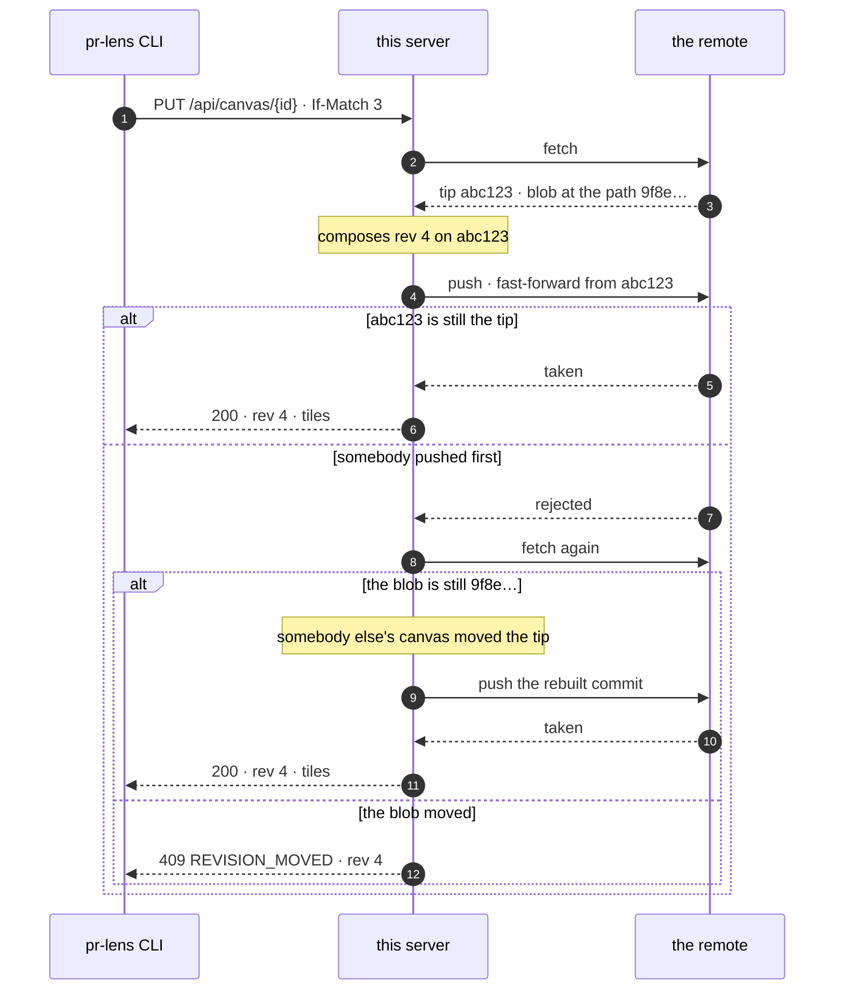

# Why git works

A canvas store looks like it needs a database, and mostly it does not. Reading
the contract closely, it needs exactly three things: somewhere to put a document
by id, a hash of a token beside it, and **a compare-and-swap**.

The third one is the whole problem. `If-Match` carries the revision a writer last
saw. Two writers on the same revision both push; one must create the next
revision and the other must be told `REVISION_MOVED`, with nothing changed. Get
that wrong and pushes silently overwrite each other — which is the failure nobody
notices until a diagram is missing a change.

## What git gives away

Two things, and between them they are the compare-and-swap.

**A blob's name is its contents.** `git rev-parse main:canvases/Qk/{id}.json`
answers the object id of the exact bytes at that path, and that id is a hash of
the bytes. So a read can hand back "the version I gave you" for nothing, and a
write can insist the path still holds it. Two writers on the same revision read
the same id; the second to arrive finds a different one and is told the revision
moved. No history walk, no commit to look up, no extra round trip.

**A push is fast-forward or nothing.** The commit is composed on the tip this
replica last fetched, so if anybody committed in between, the remote refuses the
push — and that refusal is not a conflict by itself, because the other commit was
usually a *different* canvas. So a refusal re-fetches and asks the blob question
again: still the bytes we read, and the commit is rebuilt on the new tip and sent
again; different bytes, and now the conflict is real.

No database, no lock, no lease, and no host-specific API: whatever can serve
`git fetch` and `git push` can be the store. And a bonus the contract explicitly
does not offer — every push is a commit, so `git log` over a canvas file **is**
the revision history, and `git show` is a revision.

## Why not the GitLab API, which is where this started

This server used to speak GitLab's Commits API and hold its compare-and-swap in
`last_commit_id`: GitLab refuses a commit whose stated parent is no longer the
blob's last commit. That worked, and the repository it produced is the one this
store reads today — same paths, same bytes, same commit messages, so moving is a
matter of naming the remote instead of the project.

What it cost was worth leaving behind:

| | |
| --- | --- |
| **One host** | GitLab only. A GitHub, Gitea, Forgejo or bare-ssh repository is the same data structure and was unreachable. |
| **Conflicts, spelled out in prose** | The API reports "the blob moved" and "another commit reached the branch first" with the same 400, told apart only by the sentence in the body — and GitLab has changed that sentence, which was a real bug in a real release. A push either fast-forwards or it does not, and git says which in a machine-readable line. |
| **An etag that needs a lookup** | `last_commit_id` is the commit that last touched a path, which the server has to go and find. A blob id is already there. |
| **A count that gave up** | Paging the tree over HTTP meant counting stopped at twenty pages and answered "at least". `git ls-tree` walks the whole tree locally, so the count on the page is exact. |

## Why not the other things a git host offers

| | |
| --- | --- |
| **Snippets** | Each is a git repository, so versions exist — but the update API has no CAS. Two concurrent pushes last-write-wins, silently. |
| **Issue notes** | ~1 MB per note against the contract's 4 MB documents, no CAS, JSON hiding in a fenced block, and every push spamming the issue. Charming, unsound. |
| **Package registries** | Immutable versions map neatly onto revisions, but `NOT_FOUND` versus conflict gets muddy and deleting every revision of one canvas is awkward. |

## What it costs, and why that is fine

**A mirror on disk.** The server keeps a bare clone and never checks anything
out; every write is plumbing over a throwaway index. The mirror is a cache and
holds no truth the remote does not, so a pod that moves and loses its `emptyDir`
re-clones and carries on. It does grow — a commit per push, for ever — and
automatic gc is turned off so a repack can never fire in the middle of a push.
Delete the directory when it gets big; the next call rebuilds it.

**Writes serialise on the branch tip.** Every write in the deployment ends at the
same ref, and the remote takes them one at a time. So a pod queues its own writes
instead of racing them — racing buys nothing when the remote serialises anyway,
and it turns one push into two — and a write that loses the tip to another pod
composes again on the new one. The ceiling is about one write per round trip for
the whole deployment, which for diagrams attached to pull requests is nowhere
near the traffic. It is, however, a ceiling that more replicas do not raise.

**A round trip per uncached read.** `GIT_FETCH_TTL_MS` is zero by default, so a
read that the in-memory cache did not answer fetches first. That is the same cost
the GitLab API call had, and it buys the same promise.

**Reads are cached in memory** for `READ_CACHE_TTL_MS`, five seconds by default.
This is safe for a reason worth stating, because it is the load-bearing argument
of the whole design: *a stale read is never the basis of a write.* The etag
travels with the read, the store compares it, and a stale etag comes back as a
conflict. The only thing staleness could cost is a conflict reporting the wrong
revision — so a conflict re-reads past the cache before it answers. Everything
else a stale read can do is answer a `GET` five seconds late.

That same argument is why two replicas need no coordination, and why the store
interface is four methods with no transaction in sight.

## The one place two writers both win

A write whose bytes are already in the repository composes the commit that is
already in the repository — same tree, same parent, same message, and, within the
same second, the same timestamp, which makes it the same object id. Pushing it is
a no-op and the writer is told it was written.

That is the right answer rather than a hole in the CAS. It can only happen when
two writers wanted byte-identical content at the same revision, and after both
are told "written", the repository holds exactly what each of them asked for.
Nobody's write was lost; there was only ever one write to make.
